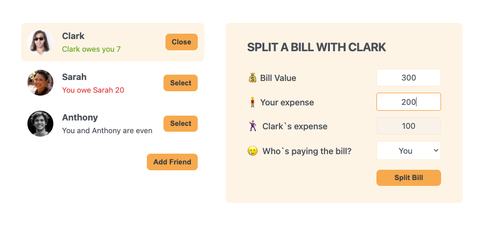

# Eat'n'Split



## Overview
Split the Bill is a React application that allows friends to track and manage shared expenses in a user-friendly manner.
This app is a React challenge from the [Jonas Schmedtmann's](https://codingheroes.io/) course in Udemy.
It was very helpful for me  to clarify further the concepts about state management and its  best practices!

## Features

- **Add Friends**: Easily add new friends to your list with a name and image.
- **View Balances**: Check how much you owe or are owed at a glance.
- **Split Expenses**: Quickly and efficiently divide a bill between yourself and a friend.
- **Manage Freely**: Freely select friends, view their data, and manage balances.

## Getting Started

### Prerequisites

Ensure you have [Node.js](https://nodejs.org/) and [npm](https://www.npmjs.com/) installed.

### Installation

1. Clone the repository:
   ```sh
   git clone https://github.com/ELal3k/eat-n-split.git

2. Navigate into the project directory:
   ```sh
   cd split-the-bill

3. Install dependencies:
	 ```sh
	 npm install
4. Start the development server:
	```sh
	npm start
